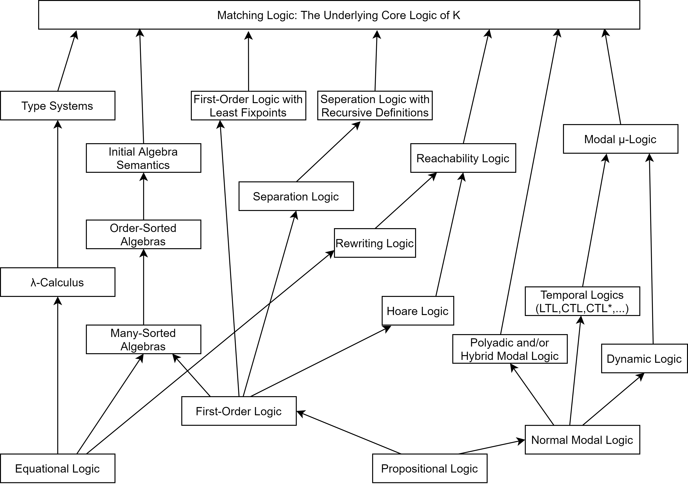

# Smart contract formal verification

In `example-smart-contracts` you will find an environment where we have a standard forge project (`smart-contracts`). We also have a kevm specification (in `kevm`) in which we describe the specifications for the contracts to formally verify.

Instruction on how to formally verify a smart contract can be found in `./example-smart-contracts/kevm/VeriToken-spec.md`.
Instruction on how to use other formal verification tools like **SMTChecker** and **hevm** can be found in `./example-smart-contracts/README.md`.

To get in contact with the developers of the k-framework and kevm, go to the channel on [Riot](https://riot.im/app/#/room/#k:matrix.org).

## Formal verification

Formal verification is a very wide field. The 'amount' and what kind of formal verification should be done on a project depends per project.

### Satisfiable Modulo Theory (SMT)
In short, SMT allows us to define a set of constraints and determine if it can be true or not (satisfiability).

It is used by almost all verification tools.

### Symbolic execution
Symbolic execution takes multiple paths in the code. But instead of using concrete values, symbolic values are used. So when an input variable (after some manipulation) would be used in a branch, the program would take both branches. When one of the branches would then throw as error, the tool would determine a concrete value which would cause the taking of this branch.

The second speaker of [this talk](https://youtu.be/RunMhlTtdKw?t=2033) explain the basics of how it is done in hevm.

### Model checking

### Matching logic
http://www.matching-logic.org/
https://www.youtube.com/watch?v=Awsv0BlJgbo

Matching logic can define a multitude of other logics:



Matching logic lets someone define a language's semantics as rewrite rules.

In matching logic a 'state' in a program is represented as a configuration. A rewrite rule `lhs => rhs` means that when the `lhs` matches the current configuration, it will be rewritten to the `rhs`.

## Verifying code vs bytecode
Here only tools uses in the repo are considered.

Works on Solidity code:
- SMTChecker

Working on bytecode:
- hevm
- kevm

The main benefit of 

## Docker

Installing formal verification tools can take quite some time. Additionally, installing kevm can be a bit tricky since it is still development. Therefore docker images are created to make life easier.

### Note on cpu architecture

Currently there are only `x86_64` compatibal images built.

### hevm
```bash
$ docker build -t ghcr.io/enzoevers/hevm:latest -f docker/Dockerfile.hevm .
$ docker push ghcr.io/enzoevers/hevm:latest
```

### kevm
```bash
$ docker build -t ghcr.io/enzoevers/kevm-solc:latest -f docker/Dockerfile.kevm .
$ docker push ghcr.io/enzoevers/kevm-solc:latest
```
